# API Template

This is a template repository for API:s. The idea is to copy this repository when creating new API:s.

```mermaid
flowchart TB
    %% Define nodes with better structure
    openapi["📄 OpenAPI<br/>Specification"]:::spec
    
    %% Build artifacts
    npm["📦 NPM Package<br/><small>TypeScript Client + Mocks</small>"]:::npm
    jar["☕ JAR Package<br/><small>OpenAPI Spec Bundle</small>"]:::jar
    
    %% Repository
    repo[("🏛️ Repository<br/><small>Maven / NPM</small>")]:::repo
    
    %% Applications
    app1["🖥️ REST Application A<br/><small>Implements API</small>"]:::server
    app2["🖥️ REST Application B<br/><small>Consumes API</small>"]:::client
    webapp["🌐 Web Application<br/><small>Frontend Client</small>"]:::web

    %% Build flow
    openapi -.->|"🔨 gradle build"| jar
    openapi -.->|"⚙️ npm build"| npm
    
    %% Publish flow
    jar -->|"📤 publish"| repo
    npm -->|"📤 publish"| repo
    
    %% Usage flow
    repo -->|"☕ Maven"| app1
    repo -->|"☕ Maven"| app2
    repo -->|"📦 npm install"| webapp
    
    %% Integration flow
    app2 -.->|"🔗 HTTP API calls"| app1
    webapp -.->|"🔗 HTTP API calls"| app1

    %% Styling
    classDef spec fill:#e1f5fe,stroke:#0277bd,stroke-width:3px,color:#000
    classDef npm fill:#f3e5f5,stroke:#7b1fa2,stroke-width:2px,color:#000
    classDef jar fill:#fff3e0,stroke:#ef6c00,stroke-width:2px,color:#000
    classDef repo fill:#e8f5e8,stroke:#2e7d32,stroke-width:3px,color:#000
    classDef server fill:#fff8e1,stroke:#f57f17,stroke-width:2px,color:#000
    classDef client fill:#e3f2fd,stroke:#1976d2,stroke-width:2px,color:#000
    classDef web fill:#fce4ec,stroke:#c2185b,stroke-width:2px,color:#000
```



## NodeJS

Code is generated from OpenAPI spec using [openapi-node-client-generator-cli](https://github.com/Forsakringskassan/openapi-node-client-generator-cli).

This template also contains [mocks](/src/mock) that are on the format used by [apimock-express](https://github.com/Forsakringskassan/apimock-express).

Output is a fully working, type safe, Fetch-client and type safe mocks. Packaged as an NPM package.

### Try it

You can try it by cloning this repository and do:

```sh
npx @forsakringskassan/openapi-node-client-generator-cli@latest \
 --package-name $(basename "$PWD") \
 --package-version $(npx git-changelog-command-line --print-next-version) \
 --package-url https://github.com/Forsakringskassan/${GITHUB_REPOSITORY} \
 && npm install \
 && npm run build
```

And cleanup with `npm run git:clean`.

## Gradle

This repository also has the `se.fk.gradle.bundle-openapi` plugin from [gradle-conventions](https://github.com/Forsakringskassan/gradle-conventions).

It creates a JAR with the openapi specification in it. So that it can be published to a repository and used for code generation on the consumer side. See more in [gradle-conventions](https://github.com/Forsakringskassan/gradle-conventions).

## Release

Release is triggered by Gradle, it will push a tag that triggers the NPM release: <https://github.com/Forsakringskassan/template-api/actions/workflows/api-npm-release.yaml>

The release will publish:

- Maven artefact: <https://github.com/orgs/Forsakringskassan/packages?repo_name=template-api>
- NPM package: <https://www.npmjs.com/package/@forsakringskassan/template-api>
